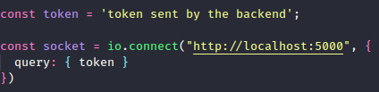

# SOCIAL NETWORK API 😁

## 📘 Conteúdo: 

Vamos entender primeiramente oque faz cada programa, temos duas pastas: api-express e socket-communication.

> **Api-express**: Api que cria, atualiza, deleta e consulta dados do usuário no banco postgres e cria os tokens de autenticação.
> 
> ***socket-communication***: Cria conexão bidimensional entre servidor e cliente (usuários)

***OBS.*** Primeiramente quero dizer que o código em si já é meio casca grossa, se você
não está familiarizado com Api, autenticações, comunicação bidimensional, ORM, 
Por favor estude um pouco antes sobre cada assunto para não ficar confuso.

## Sistema de rotas (Api Express)📍

HTTP | ROUTE | HEADER | BODY | DESCRIÇÃO |
| --- | ------ | ------ | ------ |-----------
| GET | /users/:_id | Authorization: Bearer (token) | ID no parâmetro de rota | Rota retorna dados do usuário cujo id seja informado.
| POST | /users | JSON (email (string), password (string), nickname (string) | | Rota para criar usuários.
| POST | /auth | JSON (email (string), password (string) | | Rota que gera token e retorna dados do usuário.
| DELETE | /users/:_id | Authorization: Bearer (token) | ID no parâmetro de rota | Rota deleta usuário cujo id foi fornecido 
| PUT | /users/:_id | JSON (email (string), password (string), nickname (string) | ID no parâmetro de rota | Rota para criar usuários.

## Sistema de rotas (Socket communication)📍
HTTP | ROUTE | HEADER | BODY | DESCRIÇÃO |
| --- | ------ | ------ | ------ |-----------
| GET | / | Authorization: Bearer (token) | | Rota cria conexão bidimensional.


## Como funciona ❓❓❓

Bom, vamos do principio. 

Você é usuário novo que quer entrar na plataforma, primeiro você se registra, na `rota de criação` logo após vai para a `rota de autenticação` onde será retornado um token ter acesso a o sistema socket.

no projeto [Socket.io-client](https://github.com/JoaoFelixx/socket.io-client) Você pode fazer o teste, porém no arquivo

`src/App.js` altere a conexão com esse código:



Na parte do token é só colar o token que o back-end envia naquele trecho assim funcionará, mas caso não colocar você não conseguirá interagir com outros usuários.

## ***Implemente dessa forma:***

```js
const token = 'ojdfaskksa-sfg-sdfsfsfsfssae';

const socket = io.connect('localhost:5000/', {
  query: { token }
});
```

Se algum desenvolvedor achar algum bug ou quiser melhorar ainda mais o projeto só abrir uma `issue` e conversar sobre melhorias e defeitos.

## Happy Hacking 💻